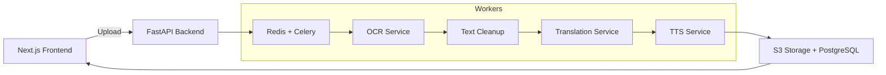

# AI Innovator: Thai‑to‑Isan TTS Web Application

A web application that empowers local community leaders (e.g., village heads, government offices) to upload official documents and automatically convert them into spoken announcements in the Isan dialect. The pipeline uses OCR, machine translation (Thai → Isan), and text‑to‑speech (TTS) to generate high‑quality audio files ready for playback or download.

---

## 🌟 Features

* **Multi‑Format Upload**: Support for PDF, image (JPEG/PNG), DOCX, and plain text files.
* **OCR Extraction**: Automatically extract Thai text from scanned documents using PaddleOCR or Tesseract.
* **Isan Translation**: Translate standard Thai text into the Isan dialect via a fine‑tuned MarianMT/T5 model.
* **Isan TTS**: Generate clear, natural Isan audio using Coqui TTS or VISTEC‑TTS models; output in WAV/MP3.
* **Asynchronous Processing**: Celery + Redis task queue for scalable, non‑blocking pipelines.
* **User Dashboard**: Track job status, preview announcements, and download completed audio files.
* **Role‑Based Access**: Register as a `VillageHead` or `Organization` to manage announcements.

---

## 🔧 Architecture



1. **Frontend**: Next.js (React) with [Tailwind CSS](https://tailwindcss.com/) or [ShadCN/UI](https://github.com/shadcn/ui)
2. **API**: FastAPI (Python) with OAuth2/JWT authentication
3. **Task Queue**: Celery + Redis for pipeline orchestration
4. **OCR**: PaddleOCR or Tesseract for text extraction
5. **Translation**: Hugging Face Transformers (MarianMT or T5) fine‑tuned on Thai–Isan data
6. **TTS**: Coqui TTS or VISTEC‑TTS for high‑quality Isan speech synthesis
7. **Storage**: AWS S3 (files) + PostgreSQL (metadata) via SQLAlchemy
8. **Deployment**: Docker Compose / Kubernetes / AWS ECS

---

## 🚀 Getting Started

### Prerequisites

* Node.js ≥ 18
* Python ≥ 3.9
* Docker & Docker Compose (optional)
* Redis server
* PostgreSQL database
* AWS S3 bucket (or compatible object storage)

### Clone the Repository

```bash
git clone https://github.com/AssaniIndraprasitdhi/ai-innovator.git
cd ai‑innovator
```

### Backend Setup

1. Create and activate a Python virtual environment:

   ```bash
   python -m venv .venv
   source .venv/bin/activate  # Linux/macOS
   .\.venv\Scripts\activate  # Windows
   ```
2. Install dependencies:

   ```bash
   pip install -r backend/requirements.txt
   ```
3. Copy and configure environment variables:

   ```bash
   cp backend/.env.example backend/.env
   # Edit .env to set DB_URL, REDIS_URL, AWS credentials, JWT secret, etc.
   ```
4. Run database migrations:

   ```bash
   alembic upgrade head
   ```
5. Start the FastAPI server:

   ```bash
   uvicorn backend.main:app --reload
   ```

### Frontend Setup

1. Navigate to the frontend folder and install packages:

   ```bash
   cd frontend
   npm install
   ```
2. Copy and configure environment variables:

   ```bash
   cp .env.example .env.local
   # Set NEXT_PUBLIC_API_URL to your FastAPI endpoint
   ```
3. Start the development server:

   ```bash
   npm run dev
   ```
4. Open [http://localhost:3000](http://localhost:3000) in your browser.

### Celery Workers

In the project root, run:

```bash
cd backend
celery -A worker.celery_app worker --loglevel=info
```

---

## 🎯 Usage

1. **Register/Login** as a Village Head or Organization.
2. Navigate to **Upload Announcement**, select your document, and submit.
3. Monitor job status in **My Announcements**.
4. Once completed, click ▶️ to preview or 📥 to download the Isan TTS audio.

---

## 🤝 Contributing

1. Fork the repository.
2. Create a feature branch: `git checkout -b feature/YourFeature`
3. Commit your changes: `git commit -m "Add YourFeature"`
4. Push to the branch: `git push origin feature/YourFeature`
5. Open a Pull Request.

Please follow the [Code of Conduct](CODE_OF_CONDUCT.md) and ensure all tests pass.

---

## 📬 Contact

For questions or feedback, open an issue or contact the maintainer at `Assani.indraprasitdhi@gmail.com`.
